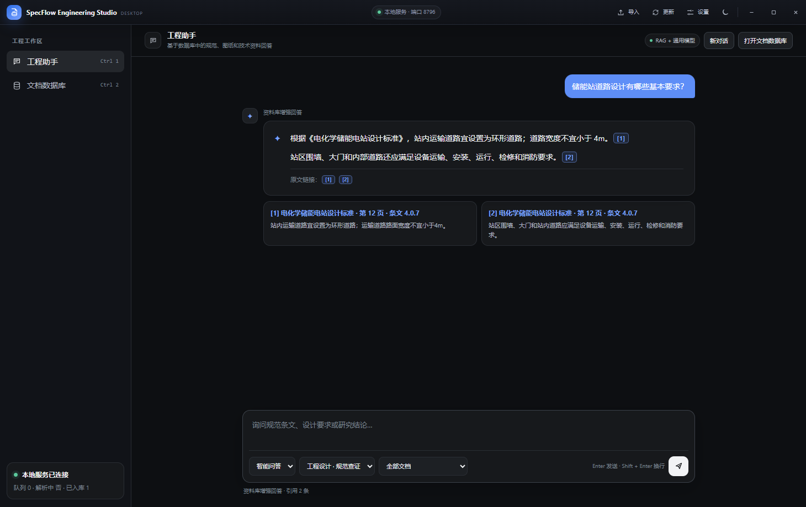
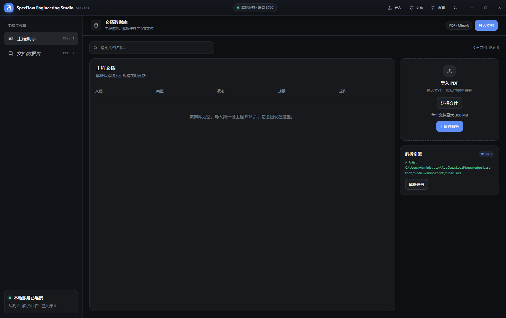
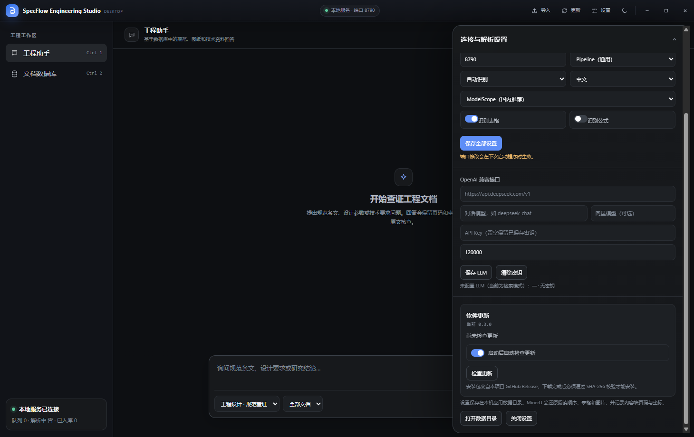
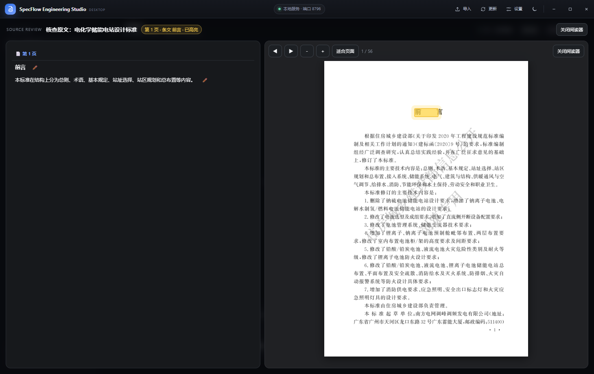

# SpecFlow Engineering Studio

面向工程规范与技术资料的本地桌面工作台。它把 **DeepSeek Harness Agent、MinerU 文档解析、工程资料数据库、知识问答、原文定位与高亮核查** 放在同一个 Windows 客户端中，同时保留标准 HTTP API，便于后续接入其他 Agent 或知识库平台。

[](https://github.com/Maskicruis/specflow-engineering-studio/releases/latest)
[](https://github.com/Maskicruis/specflow-engineering-studio/releases/latest)
[](#开发与验证)

> 独立工程版使用单独的产品名、应用标识、数据目录和 Release，不会覆盖早期知识库项目。



## 主要能力

- **DeepSeek Harness Agent**：内置官方 DSH 运行时与 Web 工作区，提供类似 Codex 的项目记录、会话记录、智能体对话和工程工具调用；无需单独安装 Node.js 或 Harness。
- **项目工作区**：从“DeepSeek 智能体”页打开任意本地工程目录，项目会登记到 Harness 左侧记录中，后续可以继续原会话。
- **API 余额**：自动读取官方 DSH 凭据，在标题栏显示 DeepSeek API 余额；密钥仅在主进程使用，不会暴露给页面。
- **完整工程助手**：像通用大模型客户端一样连续对话；可选“智能问答”“仅资料库”“通用对话”，资料不足时不再让整套系统失去通用问答能力。
- **最近对话**：左侧显示类似 Codex 的最近对话列表；点击即可恢复完整多轮内容、引用和检索范围，也可继续追问。
- **文档数据库**：集中管理 PDF、解析队列、状态、页数、图片和内容规模；支持新建、重命名和删除文件分组，以及逐文档归组。
- **分组问答**：问答范围可选择全部文档、指定分组、未分组或单个文档；空分组不会意外回退到全库检索。
- **MinerU 精准解析**：按真实阅读顺序输出 Markdown/结构化内容，保留表格、图片、页码和页内坐标。
- **引用与原文核查**：引用编号在相关句子后直接显示为超链接，回答末尾另列“文档名 + 页码 + 条文号 + 打开原文”链接；点击后直接跳回 PDF 对应页并高亮命中区域。
- **完整 PDF 阅读器**：自动适合页面，阅读器避开原生标题栏，顶部和工具栏均保留关闭入口。
- **混合检索**：默认本地 BM25；配置向量模型后自动使用 BM25 + 向量 RRF 融合。
- **标准接口**：提供版本化 API、能力发现、Schema、SSE 流式问答和结构化条目导出。
- **客户端更新**：在“设置 → 软件更新”检查、下载并安装 GitHub Release；安装包必须通过 SHA-256 校验。







## 下载与安装

进入 [最新 Release](https://github.com/Maskicruis/specflow-engineering-studio/releases/latest)：

- 推荐：`SpecFlow-Engineering-Studio-Setup-<版本>-x64.exe`，可选择安装位置，会创建桌面和开始菜单快捷方式；
- 免安装：`SpecFlow-Engineering-Studio-Portable-<版本>-x64.exe`，直接运行；
- 完整性校验：`SHA256SUMS.txt`。

安装包已内置 DeepSeek Harness 与独立 Node.js 运行时；**不内置 MinerU 模型和运行环境**。首次使用请在右上角“设置”中选择已经安装的 `mineru.exe`，点击“检测”。详见 [安装说明](docs/INSTALL_CN.md)。

## 使用流程

1. 打开“DeepSeek 智能体”，在左侧项目记录中继续已有工程，或点击“打开项目”登记新的本地目录。
2. 在 DSH 设置中配置 DeepSeek API Key 后，标题栏会显示可用余额；点击余额可刷新。
3. 打开“设置”，选择文档数据库目录和 `mineru.exe`，保存后点击“检测”。
4. 在“文档数据库”页创建项目或专业分组，把已有文件归组；导入新 PDF 时也可以直接指定目标分组。
5. 在“知识库问答”中选择智能问答、仅资料库或通用对话，并在范围菜单中选择全部文档、指定分组或单个文档。点击正文引用或文后“打开原文”链接即可核查 PDF 并高亮。
6. 左侧“最近对话”可恢复并继续既有问答，新对话按钮会创建一条独立记录。
7. Harness Agent 可通过自动安装的 `specflow-knowledge-base` Skill 调用本机知识库 API，并保留可追溯引用。
8. 后续版本可在“设置 → 软件更新”中直接检查、下载和覆盖安装，项目记录、对话、分组和资料库不会被删除。

## 独立运行与 Agent 接入

桌面应用自行启动本地服务，无需浏览器。作为可调度工具时可只启动标准服务：

```powershell
node .\cli.js serve --host 127.0.0.1 --port 8890 --no-open
```

常用接口：

```text
GET   /api/v1/health
GET   /api/v1/capabilities
GET   /api/v1/groups
GET   /api/v1/search?q=消防车道&topK=8
POST  /api/v1/ask
POST  /api/v1/ask/stream
GET   /api/v1/conversations?summary=1
GET   /api/v1/documents/:id/content
GET   /api/v1/documents/:id/source
POST  /api/v1/export/items
PATCH /api/v1/settings
```

响应采用统一成功/错误封装；请求支持 `retrievalMode: auto|knowledge|general`、`conversationId`、多轮 `history`、`groupId` 和 `docIds`。引用包含文档 ID、页码、条文号、PDF 点坐标 `bbox` 与稳定的 `bboxNormalized`，适合被 Agent 消费并回溯证据。

## 数据与隐私

- PDF、解析结果、索引、会话与设置默认保存在当前 Windows 用户的应用数据目录或用户指定的数据库目录；
- Harness 的项目/会话与凭据沿用当前用户的 `%USERPROFILE%\.dsh`；应用只读取 API Key 来查询余额，绝不把密钥传给页面或写入日志；
- 更新和覆盖安装不会主动删除资料库；
- 智能/资料库模式会把检索命中的片段发给已配置的 LLM；通用对话只发送对话内容。若使用本地兼容模型，可保持资料不外发；
- API Key 不写入仓库，也不会进入 Release 产物。

## 开发与验证

```powershell
npm install
npm test
npm run desktop
npm run build:desktop
```

`npm run build:desktop` 会先准备独立 Node.js 运行时，再生成 Windows x64 安装版和便携版。v0.6.0 自动化验证为 **52/52 通过**，覆盖 DSH 启动、项目登记、余额密钥隔离、最近对话恢复、文件分组、分组检索、更新下载与哈希校验、解析顺序、连续文本块合并、表格、坐标、三种问答模式、多轮上下文、正文/文后原文链接、引用定位和标准接口。

更多文档：[安装说明](docs/INSTALL_CN.md) · [更新机制](docs/UPDATES_CN.md) · [v0.6.0 发布说明](docs/RELEASE_NOTES_0.6.0_CN.md)
